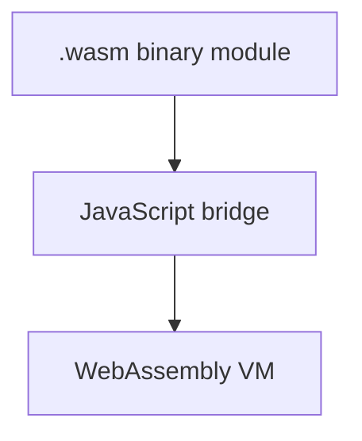

---
layout: intro
---
# WebAssembly  
## El navegador más allá de JavaScript

<div class="absolute bottom-10">
  <span class="font-700">
	<bold>José A. Galindo</bold>
	jagalindo@us.es  
  </span>
</div>

---

# ¿Qué es WebAssembly?

- Formato binario portable
- Diseñado para navegadores modernos
- Seguro, eficiente, multiplataforma
- Complementa a JavaScript

## Lo que **no** es WebAssembly

- ❌ Un reemplazo de JavaScript  
- ❌ Un lenguaje que escribes a mano  
- ❌ Inseguro o sin control  
- ❌ Difícil de integrar

---
layout: image-right
image: '/assets/js-smell.png'
---

# ¿Por qué WebAssembly?

- Rendimiento cercano al nativo
- Portabilidad de código existente
- Reutilización de librerías en C/C++, Rust, etc.
- Ejecutar lenguajes no-JS en el navegador


---
layout: two-cols-header
mermaid: true
---

# Arquitectura WASM

### Que queremos hacer

- Preparar binarios .wasm
- Cargar `.wasm` con `fetch()`
- Instanciar con `WebAssembly.instantiate`
- Invocar funciones desde JS

::left::

- Código `.wasm` compilado desde C, Rust...
- Puente JavaScript para comunicación.
- Máquina virtual WASM en el navegador.

::right::




---

# Ejemplo en WebAssembly Text (WAT)
<SlidevSpotlight/>
WAT (WebAssembly Text format) es la representación textual legible por humanos del código WebAssembly, que normalmente se guarda en formato binario .wasm.
Se usa principalmente para:

 - Escribir manualmente pequeños módulos.
 - Depurar o inspeccionar el contenido de un .wasm.
 - Aprender cómo funciona WebAssembly a bajo nivel.

Ejemplo:

```plaintext
(module
  (func (export "add") (param i32 i32) (result i32)
    local.get 0
    local.get 1
    i32.add)
)
```
Este módulo define una función llamada add que suma dos enteros de 32 bits.

- Probemoslo: https://webassembly.github.io/wabt/demo/
- Información: https://github.com/WebAssembly/wabt

---

# Lenguajes que compilan a WASM

- C/C++ (Emscripten)
- Rust (`wasm-pack`)
- AssemblyScript
- Go
- Python (con Pyodide)
- Kotlin/Java (con WASM backend)

---

# C/C++ con Emscripten

Código:

```c
int add(int a, int b) {
  return a + b;
}
```

Compilar a .wasm + glue JavaScript:

```bash
emcc add.c -Os -s WASM=1 -s EXPORTED_FUNCTIONS='["_add"]' -s EXPORTED_RUNTIME_METHODS='["cwrap", "ccall"]' -o add.js
```

👉 [Ver ejemplo funcional](https://jagalindo.github.io/wasm_lesson/ejemplos/c_cpp/index.html)

<!-- Install emscriptemn
git clone https://github.com/emscripten-core/emsdk.git
cd emsdk
./emsdk install latest
./emsdk activate latest
source ./emsdk_env.sh
-->
---

# Rust con wasm-pack

Código:

```rust
#[wasm_bindgen]
pub fn greet(name: &str) -> String {
  format!("Hola, {}!", name)
}
```

Compilación:
```bash
wasm-pack build --target web
```

👉 [Probar Rust + WebAssembly](https://jagalindo.github.io/wasm_lesson/ejemplos/rust/)

---

# Python con Pyodide

Cuando ejecutamos código Python, necesitamos una compilación intermedia a las primitivas de C. 
De eso se encarga el proyecto Pyodide, originalmente funaddo por mozzila. 
Esta es la idea:
```html
<script src="https://cdn.jsdelivr.net/pyodide/v0.23.0/full/pyodide.js"></script>
<script>
  async function main() {
    let pyodide = await loadPyodide();
    await pyodide.runPythonAsync(`
      import numpy as np
      print(np.sin(np.pi / 2))
    `);
  }
  main();
</script>
```

👉 [Ejecutar código Python](https://jagalindo.github.io/wasm_lesson/ejemplos/pyodide/)

---

# Casos de uso reales

- **Figma**: motor de render en WASM
- **Photoshop Web**: portado con Emscripten
- **AutoCAD Web**: renderizado eficiente
- **Doom**: https://diekmann.github.io/wasm-fizzbuzz/doom/
- **flamapy.ide**: https://ide.flamapy.org
- Juegos 3D, editores de código (VS Code Web)

---

# ¿Cuándo usar WebAssembly?

- Operaciones pesadas (render, cálculo)
- Compatibilidad con librerías nativas
- Reutilización de código legacy
- Para extender JS, no reemplazarlo

---

# Conclusiones

- WebAssembly está cambiando la web
- Ejecuta código de cualquier lenguaje
- Rápido, seguro, portable
- Ecosistema en crecimiento

---

# Recursos útiles

- [https://webassembly.org](https://webassembly.org)
- [https://emscripten.org](https://emscripten.org)
- [https://pyodide.org](https://pyodide.org)
- [https://rustwasm.github.io/wasm-pack](https://rustwasm.github.io/wasm-pack)
- [https://github.com/AssemblyScript/assemblyscript](https://github.com/AssemblyScript/assemblyscript)

---
layout: statement
---
# ¡Gracias!
