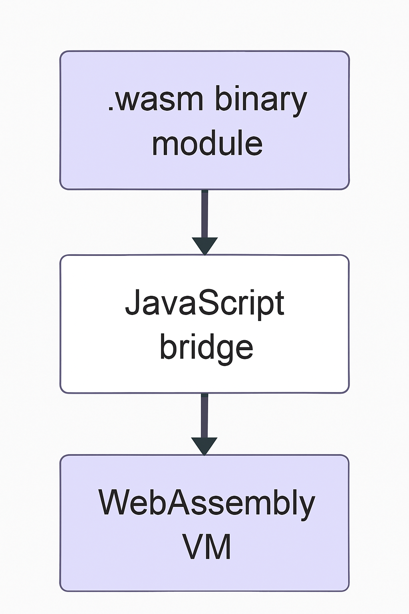

<!-- _class: lead -->
# WebAssembly  
### Más allá de JavaScript

**José A. Galindo**  
<small>Charla de 30 minutos</small>
jagalindo@us.es
---

## ¿Qué es WebAssembly?

- Formato binario portable
- Diseñado para navegadores modernos
- Seguro, eficiente, multiplataforma
- Complementa a JavaScript

---

## ¿Por qué WebAssembly?

- Rendimiento cercano al nativo
- Portabilidad de código existente
- Reutilización de librerías en C/C++, Rust, etc.
- Ejecutar lenguajes no-JS en el navegador

---

## Arquitectura básica



---

## Ejemplo en WebAssembly Text (WAT)

```wat
(module
  (func (export "add") (param i32 i32) (result i32)
    local.get 0
    local.get 1
    i32.add)
)
```

---

## Lenguajes que compilan a WASM

- C/C++ (Emscripten)
- Rust (`wasm-pack`)
- AssemblyScript
- Go
- Python (con Pyodide)
- Kotlin/Java (con WASM backend)

---

## C/C++ con Emscripten

Código:

```c
int add(int a, int b) {
  return a + b;
}
```

---

Compilación:

```bash
emcc add.c -s WASM=1 -Os -o add.wasm
```

👉 [Ver ejemplo funcional](https://jagalindo.github.io/wasm_lesson/ejemplos/c_cpp/)

---

## Rust con wasm-pack

Código:

```rust
#[wasm_bindgen]
pub fn greet(name: &str) -> String {
  format!("Hola, {}!", name)
}
```

---

Compilación:

```bash
wasm-pack build --target web
```

👉 [Probar Rust + WebAssembly](https://jagalindo.github.io/wasm_lesson/ejemplos/rust/)

---

## Python con Pyodide

```html
<script src="https://cdn.jsdelivr.net/pyodide/v0.23.0/full/pyodide.js"></script>
<script>
  async function main() {
    let pyodide = await loadPyodide();
    await pyodide.runPythonAsync(`
      import numpy as np
      print(np.sin(np.pi / 2))
    `);
  }
  main();
</script>
```

👉 [Ejecutar código Python](https://jagalindo.github.io/wasm_lesson/ejemplos/pyodide/)

---

## AssemblyScript (TypeScript para WASM)

```ts
// assembly/index.ts
export function square(x: i32): i32 {
  return x * x;
}
```

Compilación:

```bash
npx asc assembly/index.ts --outFile module.wasm --optimize
```

👉 [Probar AssemblyScript](https://jagalindo.github.io/wasm_lesson/ejemplos/assemblyscript/)

---

## Ejecución en navegador

- Cargar `.wasm` con `fetch()`
- Instanciar con `WebAssembly.instantiate`
- Invocar funciones desde JS

---

## Casos de uso reales

- **Figma**: motor de render en WASM
- **Photoshop Web**: portado con Emscripten
- **AutoCAD Web**: renderizado eficiente
- **Doom**: https://diekmann.github.io/wasm-fizzbuzz/doom/
- **flamapy.ide**: ide.flamapy.org
- Juegos 3D, editores de código (VS Code Web)

---

## ¿Cuándo usar WebAssembly?

- Operaciones pesadas (render, cálculo)
- Compatibilidad con librerías nativas
- Reutilización de código legacy
- Para extender JS, no reemplazarlo

---

## Conclusiones

- WebAssembly está cambiando la web
- Ejecuta código de cualquier lenguaje
- Rápido, seguro, portable
- Ecosistema en crecimiento

---

## Recursos útiles

- [https://webassembly.org](https://webassembly.org)
- [https://emscripten.org](https://emscripten.org)
- [https://pyodide.org](https://pyodide.org)
- [https://rustwasm.github.io/wasm-pack](https://rustwasm.github.io/wasm-pack)
- [https://github.com/AssemblyScript/assemblyscript](https://github.com/AssemblyScript/assemblyscript)
---

<!-- _class: lead -->


# ¡Gracias!

<small>¿Preguntas?</small>
